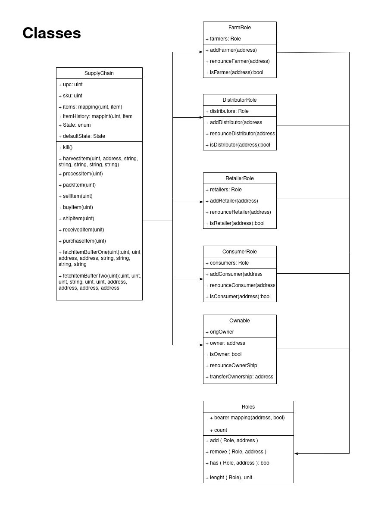

# Supply chain & data auditing

This repository containts an Ethereum DApp that demonstrates a Supply Chain flow between a Seller and Buyer. The user story is similar to any commonly used supply chain process. A Seller can add items to the inventory system stored in the blockchain. A Buyer can purchase such items from the inventory system. Additionally a Seller can mark an item as Shipped, and similarly a Buyer can mark an item as Received.

The DApp User Interface when running should look like...


# UML





## Getting Started

These instructions will get you a copy of the project up and running on your local machine for development and testing purposes. See deployment for notes on how to deploy the project on a live system.

### Prerequisites

Please make sure you've already installed ganache-cli, Truffle and enabled MetaMask extension in your browser.

```
Give examples (to be clarified)
```

### Installing

> The starter code is written for **Solidity v0.4.24**. At the time of writing, the current Truffle v5 comes with Solidity v0.5 that requires function *mutability* and *visibility* to be specified (please refer to Solidity [documentation](https://docs.soliditylang.org/en/v0.5.0/050-breaking-changes.html) for more details). To use this starter code, please run `npm i -g truffle@4.1.14` to install Truffle v4 with Solidity v0.4.24. 

A step by step series of examples that tell you have to get a development env running

Clone this repository:

```
git clone https://github.com/udacity/nd1309/tree/master/course-5/project-6
```

Change directory to ```project-6``` folder and install all requisite npm packages (as listed in ```package.json```):

```
cd project-6
npm install
```

Launch Ganache:

```
ganache-cli -m "spirit supply whale amount human item harsh scare congress discover talent hamster"
```

Your terminal should look something like this:

~/dev/udacity/coffee$ ganache-cli -m "spirit supply whale amount human item harsh scare congress discover talent hamster"


In a separate terminal window, Compile smart contracts:

```
truffle compile
```

Your terminal should look something like this:


This will create the smart contract artifacts in folder ```build\contracts```.

Migrate smart contracts to the locally running blockchain, ganache-cli:

```
truffle migrate
```
Your terminal should look something like this:


Starting migrations...
======================
> Network name:    'rinkeby'
> Network id:      4
> Block gas limit: 30000000 (0x1c9c380)


1_initial_migration.js
======================

   Replacing 'Migrations'
   ----------------------
   > transaction hash:    0x6b1a9248d5a98896eb7517f8751dc48e6af8a9e0fa2281de29d916823353e133
   > Blocks: 0            Seconds: 0
   > contract address:    0x3D2b20cF1bf9596ED28FA9b880a83D591b12CF84
   > block number:        11165931
   > block timestamp:     1659952747
   > account:             0x589250C63785D6dF687662c612421CdC608BbB25
   > balance:             19.011415959450534183
   > gas used:            239894 (0x3a916)
   > gas price:           10 gwei
   > value sent:          0 ETH
   > total cost:          0.00239894 ETH

   > Saving migration to chain.
   > Saving artifacts
   -------------------------------------
   > Total cost:          0.00239894 ETH


2_deploy_contracts.js
=====================

   Replacing 'FarmerRole'
   ----------------------
   > transaction hash:    0x813d26a93584450f51bbd014a519b615bfe3f9d559d04110c77cf4b7a8ae7761
   > Blocks: 1            Seconds: 9
   > contract address:    0x133F6d7D29FE3B7250BBAD4cEDff05e2bEa9289D
   > block number:        11165933
   > block timestamp:     1659952777
   > account:             0x589250C63785D6dF687662c612421CdC608BbB25
   > balance:             19.007814389450534183
   > gas used:            314409 (0x4cc29)
   > gas price:           10 gwei
   > value sent:          0 ETH
   > total cost:          0.00314409 ETH


   Replacing 'DistributorRole'
   ---------------------------
   > transaction hash:    0x3114df30d5b352f74f0ffefd4fd70590ca3f5a221f4b65e5bfcc3f2cc04b6e74
   > Blocks: 1            Seconds: 5
   > contract address:    0xCe4EE1398D91A8725454Ce0e67880AF096b468c3
   > block number:        11165934
   > block timestamp:     1659952792
   > account:             0x589250C63785D6dF687662c612421CdC608BbB25
   > balance:             19.004670179450534183
   > gas used:            314421 (0x4cc35)
   > gas price:           10 gwei
   > value sent:          0 ETH
   > total cost:          0.00314421 ETH


   Replacing 'RetailerRole'
   ------------------------
   > transaction hash:    0x041758c27b87589e4a43e60a8916cf775b5e9e18c01bd61fb14ef664bfb64154
   > Blocks: 1            Seconds: 9
   > contract address:    0x4E9A7A8546555e30e448338Bb21a808Bd9CEf7c9
   > block number:        11165935
   > block timestamp:     1659952807
   > account:             0x589250C63785D6dF687662c612421CdC608BbB25
   > balance:             19.001525729450534183
   > gas used:            314445 (0x4cc4d)
   > gas price:           10 gwei
   > value sent:          0 ETH
   > total cost:          0.00314445 ETH


   Replacing 'ConsumerRole'
   ------------------------
   > transaction hash:    0x4aa61efcd430ebae1caa3d4e9e8f5fc0421eee3b8abf50956b90a09990513fe4
   > Blocks: 1            Seconds: 5
   > contract address:    0xC270696BC42Acbf4d06dF4ecb260ef7B2127d2f6
   > block number:        11165936
   > block timestamp:     1659952822
   > account:             0x589250C63785D6dF687662c612421CdC608BbB25
   > balance:             18.998381519450534183
   > gas used:            314421 (0x4cc35)
   > gas price:           10 gwei
   > value sent:          0 ETH
   > total cost:          0.00314421 ETH


   Replacing 'SupplyChain'
   -----------------------
   > transaction hash:    0xeef94538594b5dc31b62935f9a8eb7544c7a520625f289a881d530c82f392d64
   > Blocks: 1            Seconds: 9
   > contract address:    0x28C042e26DD38943663bf45941094c8aC3C76b8E
   > block number:        11165937
   > block timestamp:     1659952837
   > account:             0x589250C63785D6dF687662c612421CdC608BbB25
   > balance:             18.972243239450534183
   > gas used:            2613828 (0x27e244)
   > gas price:           10 gwei
   > value sent:          0 ETH
   > total cost:          0.02613828 ETH

   > Saving migration to chain.
   > Saving artifacts
   -------------------------------------
   > Total cost:          0.03871524 ETH

Summary
=======
> Total deployments:   6
> Final cost:          0.04111418 ETH


Test smart contracts:

```
truffle test
```

All 10 tests should pass.


In a separate terminal window, launch the DApp:

```
npm run dev
```

## Built With

* [Ethereum](https://www.ethereum.org/) - Ethereum is a decentralized platform that runs smart contracts
* [Truffle Framework](http://truffleframework.com/) - Truffle is the most popular development framework for Ethereum with a mission to make your life a whole lot easier.
* [Web3] ] - Web3 is an idea for a new iteration of the World Wide Web which incorporates concepts such as decentralization, blockchain technologies, and token-based economics.

## RinkeBy Network
> Transaction ID:  0xeef94538594b5dc31b62935f9a8eb7544c7a520625f289a881d530c82f392d64
> contract address:    0x28C042e26DD38943663bf45941094c8aC3C76b8E

## Acknowledgments
* Solidity 0.4.24
* web3 1.5.2
* Ganache-cli v6.12.2(ganache-core: 2.13.2)
* Truffle v4.1.14
* truffle-hdwallet-provider 1.0.17
